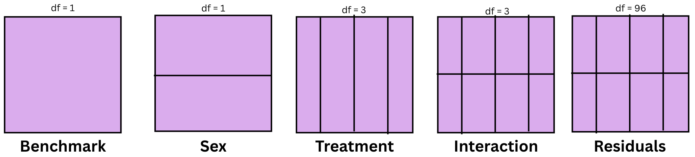
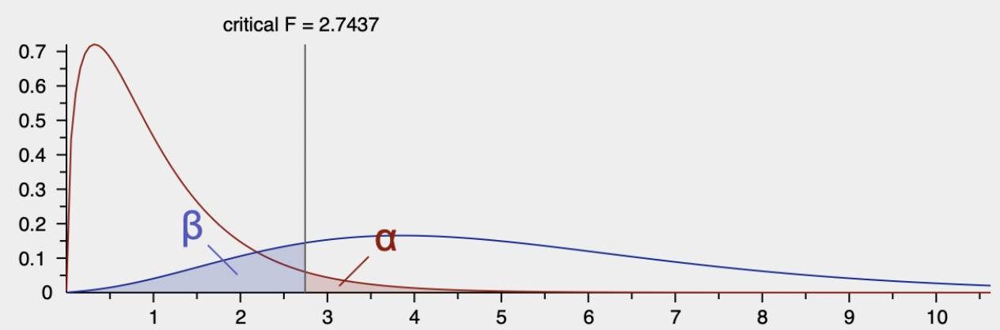
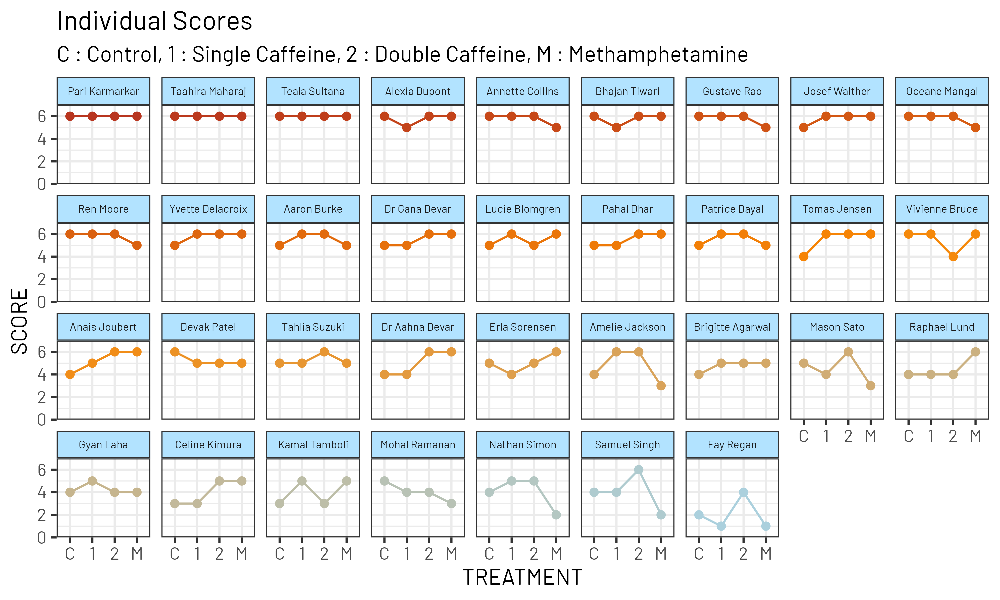
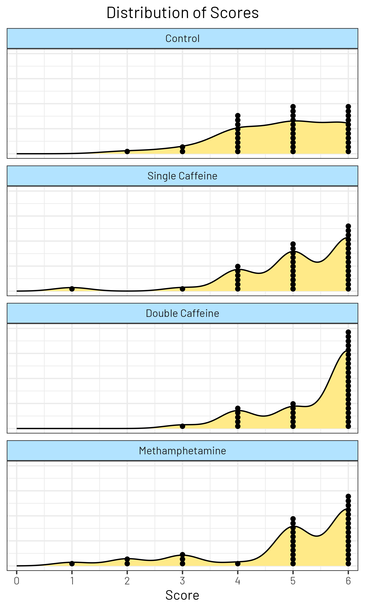
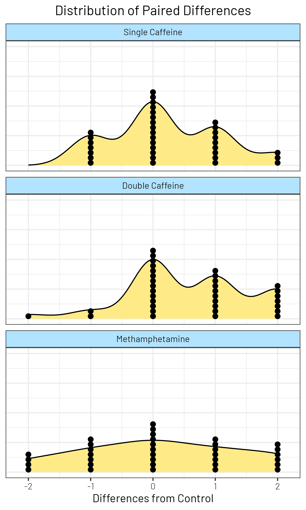
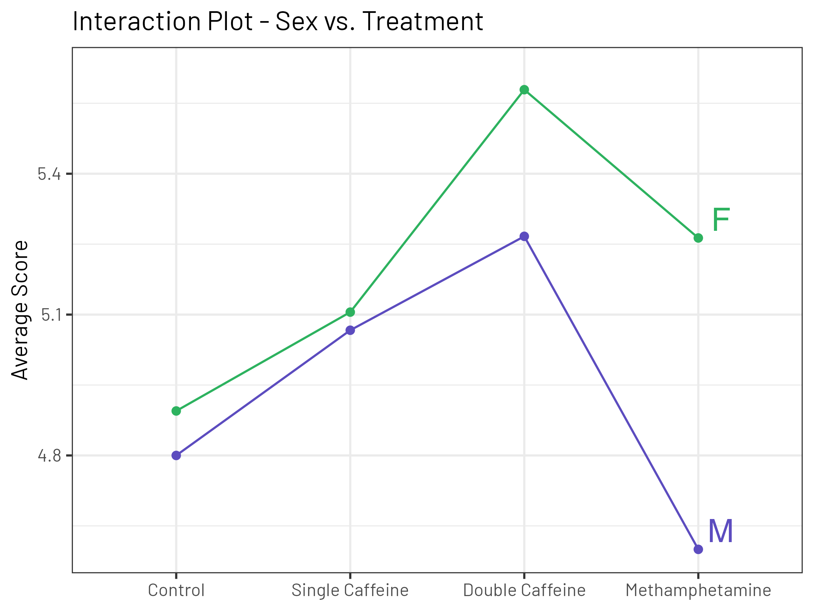
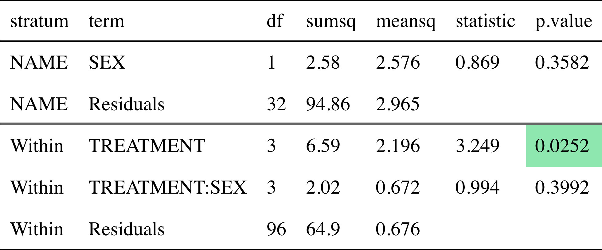
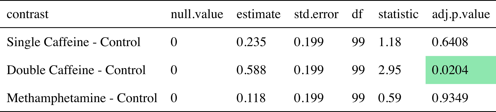
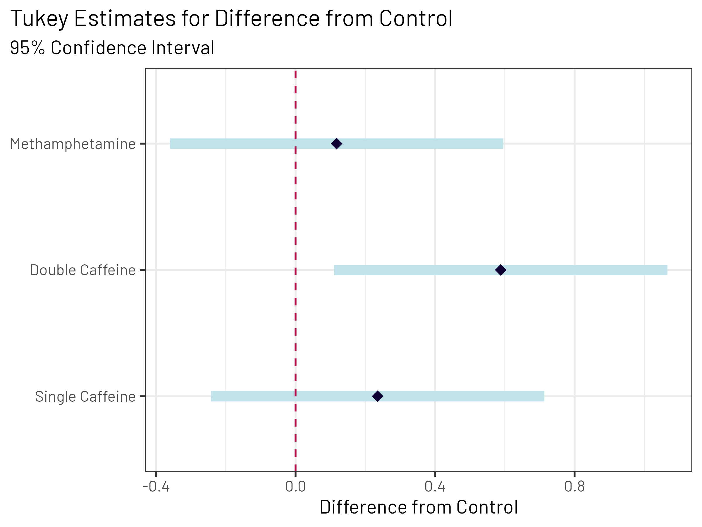
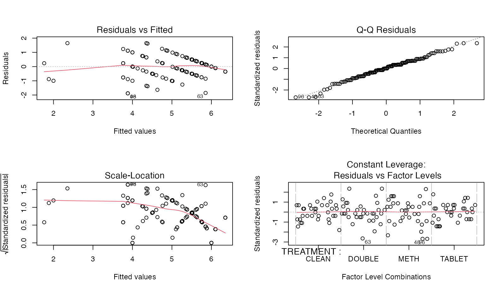

------------------------------------------------------------------------

Note: All code is accessible at [github.com/kevbaer/Stats_101b_Final_Project](https://github.com/kevbaer/Stats_101b_Final_Project) for following along!

\newpage

# 1. Introduction

When I (Kevin) was growing up, I would play in chess tournaments and often see middle and high schoolers taking caffeine pills before games. I always wondered why they did this, and whether there was any advantage to be gained by doing so.

The professional chess governing body has a list of banned substances which includes certain “cognitive-enhancing drugs” and other stimulants, including Methamphetamine, but not caffeine. Through clinical trials, Franke et al. (2017) observed that there is an effect of cognitive-enhancing drugs on chess ability, but not on in-match performance due to issues of playing quickly enough, with caffeine showing no significant performance benefit within their study. Cappelletti et al. (2017) have noted that caffeine is known to increase perception of alertness and can induce anxiety at higher doses.

In this paper, we seek to evaluate whether cognitive-enhancing drugs affect chess performance scores. We will also consider their biological sex for any interaction or impact as well.

The following research all takes place using "The Islands" simulator. This is an online environment that enables eager participants and quick data collection, but also some issues when comparing to the real world, as we'll cover later.

# 2. Methods

Firstly, our study need participants. We used the first 34 eligible individuals who provided consent for the experiment. All participants were residents of Bonne Sante Island and ages 21-29. Therefore, our population of study is "residents of the online island of Bonne Sante aged 21-29". They were chosen using a random selector of all households on Bonne Sante. This was done to prevent bias by oversampling small cities on the island. Our sample gave us a good balance of sex to use as a possible interaction.

We had four unique treatments that we wanted to study. The first is a control, where no cognitive-enhancing drug is given to the participants before their chess games. The second treatment is a single caffeine tablet (100 mg). We also tested a double dose of caffeine (200 mg) to see whether more caffeine amplified the effect. Finally, we also tested methamphetamine (10 mg) as a treatment.

Due to domain understanding, we suspected that the within-subject variability was going to be substantially left than the between-subject variability. This is because (at least in the real world), chess playing skills vary vastly among humans. We discuss later whether this belief held true on the island. But since we believed this to be true, we opted for an experimental design that would allow for effective analysis in these circumstances: two-factor repeated measures. Our first factor (treatment) would go to all 34 participants. Each participant would be tested on each treatment. We also had a second factor (sex) which would allow for investigation of imapct or interaction on chess scores.

Our response variable was the score of the subject over six chess games (three white, three black), after taking the prescribed treatment. A win was given 1 point, a draw was given $\frac 1 2$ points, and a loss was given 0 points. This means that each of the 34 players played $4 * 6 = 24$ chess games, for a total of 816 game results collected.

The factor diagram is shown below:

{fig-align="center" width="600"}

The experiment relied on effective administration to execute procedures and catalog player outcomes.

-   Chemical treatments were provided using single caffeine tablets (100 mg), double caffeine tablets (200 mg), and methamphetamine injections (10 mg) offered by the simulation of the Island.

-   The simulation provided an interactive simulation, detailing the outcome of each participant’s games as well as the time.

-   Sample size was determined G\*Power. Inferential analysis, models of analysis for repeated measures, Tukey HSD, and residual plotting were all computed using R.

Procedures: Here were the steps taken, for reproduction and replication.

1.  Determine the required sample size for a given desired power and effect size. The goal was to have a power of 0.8, an effect size of 0.25, and a significance level of 0.05. Using GPower and the predetermined parameters, a sample size of 24 proved sufficient. However, since there were 4 treatments conducted on 6 games for 2 groups, a sample size of 34 turned out to be more effective and balanced with 6 replications per treatment condition. This gave us a power of 0.94.

{fig-align="center" width="600"}

2.  Design a function that randomizes and generates a list of houses. The first 34 houses that met the age criteria (21-29), with approval of consent, were added to the study.
3.  Over four consecutive days, participants were exposed to one of the four treatment levels daily to mitigate sequence and learning effects.
4.  Upon receiving a stimulant or injection, participants had to wait 1 hour before moving on to the next step.
5.  Start with chess on white side and record their performance, either win, loss, or draw. Transition to the black side for the next game. Repeat three times. This results in a total of 3 white and 3 black games played sequentially for each participant.
6.  Maintain the process for 4 days total. Each day should administer a different treatment group until all participants have cycled through all levels of the treatment groups.

# 3. Data Analysis and Results

After collecting all the required data, we turned our attention to exploring and analyzing the results. The first thing we checked was whether our assumption of the high between-subject variability held true.

{fig-align="center" width="600"}

As we can see from the above figure, participants had roughly the same scores across the different treatments, but different greatly from other participants. This matched our expectation and proved that the repeated-measures was an excellent design choice for this project.

|  |  |
|------------------------------------|------------------------------------|
| {fig-align="center" width="300"} | {fig-align="center" width="300"} |

Next, we looked at the distribution of scores and paired differences for each treatment.

In the left figure, we are looking for substantial difference between the Control distribution and the other distributions. It's difficult to see in the left-hand figure how drastic these differences are, although it appears clear that Methamphetamine is not distinct from Control, and Double Caffeine has the best distribution of scores.

The right figure highlights the differences from control to each stimulant tested per participant. Now we are looking for a roughly central distribution. Single Caffeine and Methamphetamine's distribution appear tightly centered around 0, indicating that these treatments did not produce an effective change from Control for the majority of the participants. Double Caffeine, on the other hand, displays a shift towards the right, showing that there is a positive increase when individuals transition from Control to Double Caffeine.

{fig-align="center" width="500"}

When checking the interaction plot, we see that the response lines for male (M) and female (F) are somewhat parallel. There is some effect size differences, but there's no overlap, and everything is directionaly similar. We will do some more statistically rigorous investigation, but it appears that there isn't significant interaction between the Sex and Treatment factors.

{fig-align="center" width="600"}

Now it's time to look at our ANOVA results. By running this two-factor repeated measures ANOVA, we can investigate the following null hypotheses:

1.  The chess scores are the same for both Males and Females (ages 21-29, Bonne Sante Island).
2.  The chess scores are the same for all treatments (control, single caffeine, double caffeine, methamphetamine) (ages 21-29, Bonne Sante Island).
3.  The sex and treatment have no interaction on chess scores (ages 21-29, Bonne Sante Island).

From the above table, we can see the p-values for each of these three null hypotheses. Only one is less than our chosen alpha (0.05), and so we fail to reject null hypotheses 1 and 3.

However, we do have enough evidence from this study to reject the null hypothesis and accept that chess scores do differ across these four treatments for the study population.

Note that this model gives an $R^2$ found of 0.62. This suggests our model is explaining much of the variability in chess performance scores.

One drawback to this ANOVA method is that i doesn't tell us which (if any/many) of these four treatments differ from each other. Therefore, our next step is going to be post-hoc analysis.

{fig-align="center" width="600"}

Since it was found that not all treatments are equal to control, the Post-Hoc analysis allows us to identify which treatments differ. From the figure above we see that only Double Caffeine differs from Control at our alpha (0.05). With an average increase of +0.588 points over the control and a 95% confidence interval of (0.032, 1.144) which doesn't include 0, Double Caffeine significantly differs from Control in the positive direction. Therefore, Double Caffeine improves chess performance in this population.

{fig-align="center" width="600"}

We can also see this visualized for us in the figure above. We see that the Single Caffeine difference from control contains 0, as does the Methamphetamine. However, the double caffeine confidence interval doesn't contain 0. Note that the confidence interval for Double Caffeine contains both of the point estimate for the other two groups, indicating that they are likely not significantly different.

{fig-align="center" width="600"}

Visual inspection of the residuals is necessary to feel confident about our ANOVA and post-hoc analysis. We have a great Residuals vs Fitted plot that looks very flat. This suggests we have homoscedasticity. The Q-Q plot follows the line quite well, suggesting our residuals are normally distributed. The scale-location plot looks a little iffy, as the spread of the residuals decreases as our fitted values increase. However, we believe this to be an artifact of the consistent, high performance of several Islanders. Our constant leverage plot shows a good spread of residuals across different factors.

# 4. Conclusion

The primary goal of this study was to evaluate and determine if and how cognitive performance can be impacted by stimulants. By experimenting with different doses of caffeine tablets and the injection of methamphetamine, there is a finding in how it can be analyzed through the weight of several models of ANOVA fittings. By implementing a two-way repeated measures ANOVA design, the difference between the control group of the experiment and the treatment group allowed for an effective evaluation of which treatment group, specifically, can enhance a participant’s ability to perform better in chess.  Although sex did not provide an effect on treatment difference, the results provide evidence that the cognitive performances are highly dose-dependent.

When analyzing the interaction plots of each participant, majority showed an increase in chess performance when shifting to a higher dose of caffeine tablets, while some showed a slight decrease when shifting to methametamine.

Using Tukey HSD to provide a Post-Hoc Comparison between control and treatment, Double Caffeine (200 mg) was found to be the only treatment level to be statistically significant, in terms of increase from the control group.  By achieving a mean score of +0.588 and a p-value of 0.0204, the table outlines that Double Caffeine improves chess performance significantly within the population measured. In addition, by analyzing the table, it also shows that methamphetamine is the least effective treatment with a p-value of 0.9349 and only a mean score of +0.118. Even in the Distribution of Paired Differences plot, methamphetamine performance appears close to uniformly shaped.

By looking at the interaction plot, the interaction between males (M) and females (F) does not appear to have a perfect parallel shape, indicating that there’s not enough evidence to conclude that treatment differs by sex. In Table 1, sex only appears to have a p-value of 0.3582, which proves that sex wouldn’t make a differece to the treatment outcomes of each participant.

To conclude, this study demonstrates that cognitive enhancement during these cognitive performances does enhance the effectiveness of its outcome. Specifically, double caffeine (200 mg) shows a sustainable evidence that it is the most significant in terms of improving chess performance. Although this study benefits from a balanced repeated measures design, further studies can enhance on how cognitive-enhancing drugs or other stimulants can enhance other cognitive performances to further improve on this study.  Future research could further experiment whether drugs can enhance other cognitive performances such as SAT or Sudoku or if caffeine can affect how long it takes to complete a chess game. Age groups can be better reiterated through experimenting with different age groups in the future.

# 5. References

Bisagno, V., Gonzalez, B., & Urbano, F. - Cognitive Enhancers versus Addictive Psychostimulants: The Good and Bad Side of Dopamine on Prefrontal Cortical Circuits - Pharmacological Research 109, 108-118 (2016) - <https://doi.org/10.1016/j.phrs.2016.01.013>

Cappelletti, S. et al. – Caffeine: Cognitive and Physical Performance Enhancer or Psychoactive Drug? – <https://www.ncbi.nlm.nih.gov/pmc/articles/PMC4462044/>

Caviola L., & Faber, N. - Pills or Push-Ups? Effectiveness and Public Perception of Pharmacological and Non-Pharmacological Cognitive Enhancement - Frontiers in Psychology 6 (2015) - <https://doi.org/10.3389/fpsyg.2015.01852>

Franke, A.G. et al. – Methylphenidate, Modafinil, and Caffeine for Cognitive Enhancement in Chess: A Double-Blind, Randomized Controlled Trial – <https://doi.org/10.1016/j.euroneuro.2017.01.006>

Husain, M., & Mehta, M.A. – Cognitive Enhancement by Drugs in Health and Disease – <https://doi.org/10.1016/j.tics.2010.11.002>

Malík, M., & Tlustoš, P. – Nootropics as Cognitive Enhancers: Types, Dosage and Side Effects of Smart Drugs – <https://pmc.ncbi.nlm.nih.gov/articles/PMC9415189/pdf/nutrients-14-03367.pdf>

Mihailov, E., & Savulescu, J. - Social Policy and Cognitive Enhancement: Lessons from Chess. - Neuroethics 11, 115–127 (2018) - <https://doi.org/10.1007/s12152-018-9354-y>

------------------------------------------------------------------------

Arel-Bundock V (2026). *tinytable: Simple and Configurable Tables in 'HTML', 'LaTeX', 'Markdown', 'Word', 'PNG', 'PDF', and 'Typst' Formats*. doi:10.32614/CRAN.package.tinytable <https://doi.org/10.32614/CRAN.package.tinytable>, R package version 0.16.0, <https://CRAN.R-project.org/package=tinytable>.

Bulmer, M., & Haladyn, J. K. (2011). Life on an island: A simulated population to support student projects in statistics. *Technology Innovations in Statistics Education*, *5*(1). <https://doi.org/10.5070/t551000187>

Domin I (2025). *ggview: 'ggplot2' Picture Previewer*. doi:10.32614/CRAN.package.ggview <https://doi.org/10.32614/CRAN.package.ggview>, R package version 0.2.2, <https://CRAN.R-project.org/package=ggview>.

Lenth R, Piaskowski J (2026). *emmeans: Estimated Marginal Means, aka Least-Squares Means*. doi:10.32614/CRAN.package.emmeans <https://doi.org/10.32614/CRAN.package.emmeans>, R package version 2.0.3, <https://CRAN.R-project.org/package=emmeans>.

Lu P, Liu J, Koestler D (2017). *pwr2: Power and Sample Size Analysis for One-way and Two-way ANOVA Models*. doi:10.32614/CRAN.package.pwr2 <https://doi.org/10.32614/CRAN.package.pwr2>, R package version 1.0, commit e1f90e5a432feb11c6f59ad726bae1a4dfe0d8af, <https://github.com/cran/pwr2>.

Pedersen T (2025). *patchwork: The Composer of Plots*. doi:10.32614/CRAN.package.patchwork <https://doi.org/10.32614/CRAN.package.patchwork>, R package version 1.3.2, <https://CRAN.R-project.org/package=patchwork>.

R Core Team (2025). *R: A Language and Environment for Statistical Computing*. R Foundation for Statistical Computing, Vienna, Austria. <https://www.R-project.org/>.

Wickham H, Averick M, Bryan J, Chang W, McGowan LD, François R, Grolemund G, Hayes A, Henry L, Hester J, Kuhn M, Pedersen TL, Miller E, Bache SM, Müller K, Ooms J, Robinson D, Seidel DP, Spinu V, Takahashi K, Vaughan D, Wilke C, Woo K, Yutani H (2019). “Welcome to the tidyverse.” *Journal of Open Source Software*, *4*(43), 1686. doi:10.21105/joss.01686 <https://doi.org/10.21105/joss.01686>.

Yuan Tang, Masaaki Horikoshi, and Wenxuan Li. "ggfortify: Unified Interface to Visualize Statistical Result of Popular R Packages." The R Journal 8.2 (2016): 478-489.
